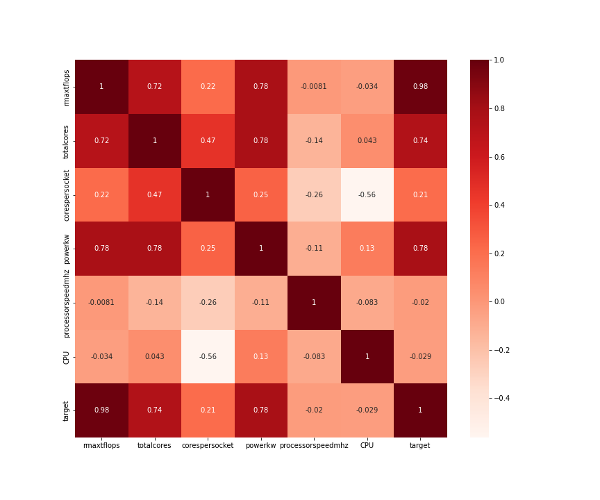
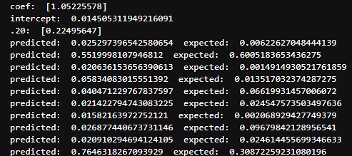

# top500 
Data Visualization & Analysis of [the latest top500 dataset](https://www.top500.org/lists/top500/) using Python and Jupyter notebook. 

To Run with Latest Dataset (June 2025)

```
python top500analysis.py
```

## Machine Learning  
### Correlation between Theoretical Peak Performance and Computer Architecture 




### Key Findings and Observations

* **Power (kw)** and **total cores** show strong positive correlations indicating that power consumption and more cores generally lead 
to higher performance.

* **Cores per socket**, **Processor Speed (mhz)**  and **CPU Type** show relatively weaker positive correlations suggesting that cores 
per socket, CPU type, and processor clock speed are not significant drivers or predictors of supercomputer performance in modern systems.

## Top500 Visualizations & Charts 

### Power vs Performance 
[Interactive Hover
Plot](http://htmlpreview.github.io/?https://github.com/tommygorham/top500/blob/main/InteractiveMachineInfoJune2025.html)

Non-interactive Plot  


<div style="display: flex; gap: 10px;">
  
  
</div>


## Trends 
### 2024 -> 2025 
* AMD CPU Share now 34.4%, Intel still leads but also continues to drop (58.8%)
* Heterogeniety (CPU+GPU) machines continues to increase, now 47% 
* 85.96% of GPUs are NVIDIA, down from 90% three years ago

### 2023 -> 2024 
* AMD CPU Share now 31%, up from 24% last year (2023) 
* 2% increase in CPU+GPU machines from 2023  
* 88.6% of GPUs still NVIDIA 

### 2022 -> 2023 
* 28 new machines with AMD CPUs replace 28 machines with Intel CPUs
* 17 new CPU + GPU Machines
* 90% of GPUs are NVIDIA
